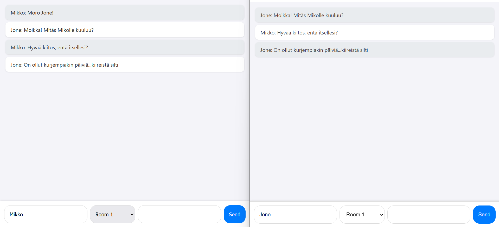
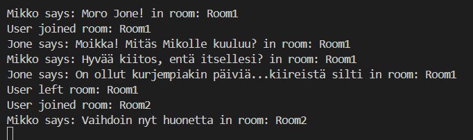

# Toteutus

Frontend lähettää viestiobjektin backendille, joka sisältää huoneen, käyttäjänimen ja viestin sisällön. Backend puolestaan lähettää viestin kaikille käyttäjille, ja frontend suodattaa viesteistä vain valitun huoneen viestit.

# Namespaces

Namespace on ylempi jaottelutaso kuin huoneet. Yksi namespace voi sisältää useamman kuin yhden huoneen.

# Screenshotit

